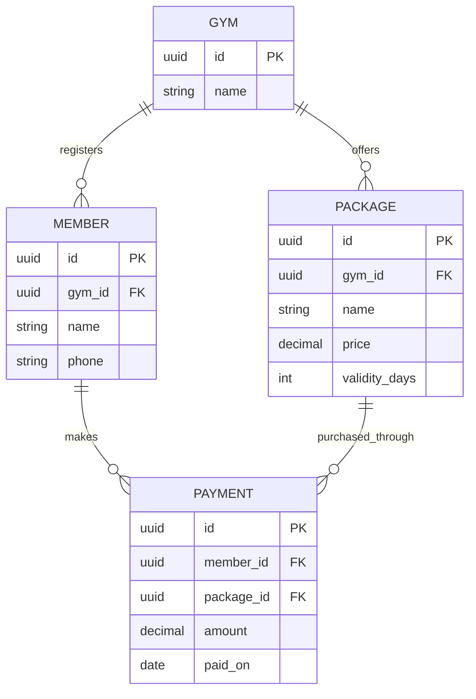

# Sample ER Diagram

Dummy schema for previewing Mermaid. This is not the final database design.

```mermaid
erDiagram
    GYM ||--o{ MEMBER : registers
    GYM ||--o{ PACKAGE : offers
    MEMBER ||--o{ PAYMENT : makes
    PACKAGE ||--o{ PAYMENT : purchased_through

    GYM {
        uuid id PK
        string name
    }

    MEMBER {
        uuid id PK
        uuid gym_id FK
        string name
        string phone
    }

    PACKAGE {
        uuid id PK
        uuid gym_id FK
        string name
        decimal price
        int validity_days
    }

    PAYMENT {
        uuid id PK
        uuid member_id FK
        uuid package_id FK
        decimal amount
        date paid_on
    }
```
